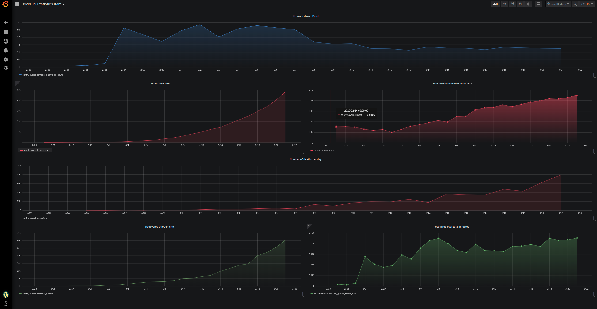

# Covid Statistics 

This simple application reads COVID-19 data shared by italian Consiglio dei Ministri. This application is developed in
Scala, with Spark, stores data on InfluxDB and visualizes data trough Grafana Dashboards.

Probably scala is not the best tool for this kind of applications, but i decided to stick with it to practice with the
progamming language I use at work. 

## Grafana & InfluxDB setup

Both Grafana and InfluxDB are available in the container that docker will pull if you run the `start_docker.sh` script.

```
./start_docker.sh
``` 

After you pull the repo, you'll need to create the database on InfluxDB (`localhost:3004`) and log into Grafana to set
the proper data source (`localhost:3003`). Remember the password on Grafana is `password` (super safe, my friend)

## Run the Metrics Generator Job

You could either run the job using a spark-submit or import the project in Intellij and run the metrics computation by simply clicking the green play button.



#### Additional Notes

Feel free to provide any feedback, suggest possible improvements or new data sources to "play" with. 

Stay safe and healthy.